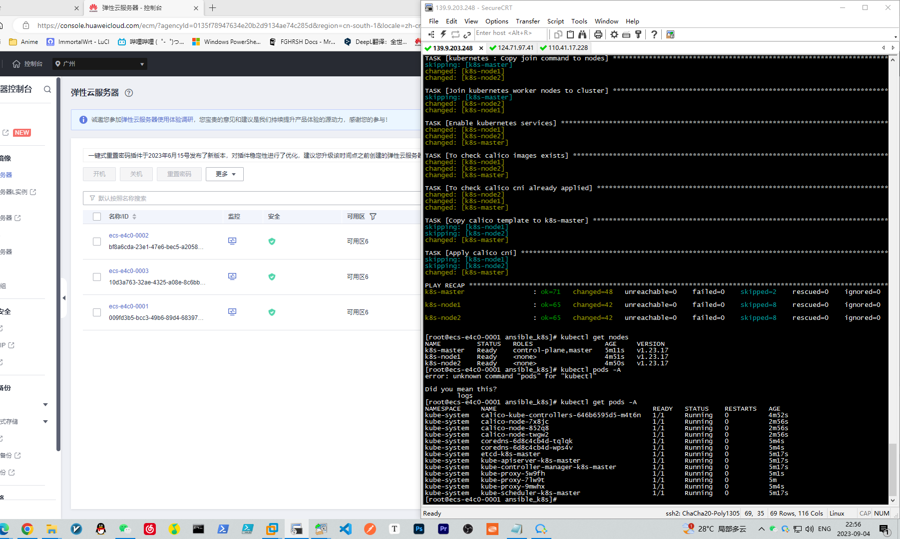

# 主机环境：
|  集群环境  | IP 地址    | cpu、内存 | 磁盘 | Kubernetes-version:        |
| :--------: | ---------- | :-------: | :--: | -------------------------- |
| k8s-master | 11.0.1.168 |   2c4g    | 40g  | v1.23.17_with_kubeadm_init |
| k8s-node1  | 11.0.1.169 |   2c4g    | 40g  | v1.23.17_with_kubeadm_init |
| k8s-node2  | 11.0.1.170 |   2c4g    | 40g  | v1.23.17_with_kubeadm_init |

## 开箱即用：

[【附件】ansible_k8s.zip](/media/attachment/2023/09/ansible_k8s.zip)

## 基础环境配置： ##


### master节点添加hosts解析：

```shell
cat >> /etc/hosts << EOF
11.0.1.168 k8s-master
11.0.1.169 k8s-node1
11.0.1.170 k8s-node2
EOF
```


### master节点安装所需工具：
```shell
yum install -y vim bash-com* net-tools expect
```


### 将vim设置为黏贴模式，防止复制时自动缩进：
```shell
echo "set paste" >> /root/.vimrc
```


### master节点对所有node节点（包括本身免密）：

### 创建SSH密钥对：
```shell
cd /root
ssh-keygen -t rsa -N "" -f /root/.ssh/id_rsa
```


#### 使用expect命令同其他受控节点进行免密：
```shell
for i in {k8s-master,k8s-node1,k8s-node2};do expect <<EOF
spawn ssh-copy-id -i /root/.ssh/id_rsa.pub root@$i
expect "yes/no" {send yes\r}
expect "password" {send 000000\r}
expect eof
EOF
done
```


### master节点安装epel-release源：
```shell
yum install -y epel-release.noarch
```


### master节点安装ansible：
```shell
yum install -y ansible
```


### master节点配置inventory_list：
```shell
cat >> /etc/ansible/hosts <<EOF
[master]
k8s-master ansible_host=11.0.1.168

[nodes]
k8s-node1 ansible_host=11.0.1.169 
k8s-node2 ansible_host=11.0.1.170 
EOF
```


### 测试所有节点是否能通信：
```shell
[root@localhost ~]# ansible -m ping all 
k8s-master | SUCCESS => {
    "ansible_facts": {
        "discovered_interpreter_python": "/usr/bin/python"
    }, 
    "changed": false, 
    "ping": "pong"
}
k8s-node1 | SUCCESS => {
    "ansible_facts": {
        "discovered_interpreter_python": "/usr/bin/python"
    }, 
    "changed": false, 
    "ping": "pong"
}
k8s-node2 | SUCCESS => {
    "ansible_facts": {
        "discovered_interpreter_python": "/usr/bin/python"
    }, 
    "changed": false, 
    "ping": "pong"
}
# 注：输出顺序不唯一
```


## 配置roles相关变量：

```yaml
- hosts: all
  vars:
    timesync_ntp_servers:		# 设置NTP服务器，多个NTP服务器使用 "-" + "服务器域名或IP"
      - ntp.ntsc.ac.cn
      - ntp.aliyun.com
    registry_mirrors: https://docker.mirrors.ustc.edu.cn/	# 设置docker镜像源
    insecure_registries: http://192.168.1.115			# 设置私有仓库
    k8s_image_Repository: registry.aliyuncs.com/google_containers	# 设置k8s镜像源
    k8s_clusterName: ansible-k8s		# 设置k8s集群名称，留空则默认为kubernetes
    k8s_serviceSubnet: 10.96.0.0/12		# 设置k8s服务子网，留空则为随机
    k8s_podSubnet: 10.244.0.0/16		# 设置k8s Pod使用的子网，留空则为随机
    calico_ipv4_cidr: 10.244.0.0/16		# 设置calico使用的子网，留空则为不设置
    calico_interface: ens33				# 设置calico使用哪张网卡与其他节点建立BGP邻居，留空则为不设置
  roles:
    - prepare
    - docker-ce
    - kubernetes
    - calico
```


# 文件夹解析：


## 文件夹相关信息：

```shell
[root@k8s-master ~]# tree ansible_k8s/
ansible_k8s/
├── ansible_with_k8s.md		# 对该目录的相关解析
├── ansible_with_k8s.txt	# 包含一些master初始化相关的操作
├── main.yml				# playbook主引导文件
└── roles					# roles目录用于存放多个playbook，为了不使所有play存在与一个book中，故拆分多个roles以便管理
    ├── calico				# calico playbook，该目录用于存放配置calico的相关文件，需要在main.yml文件中使用roles指令触发
    │   ├── defaults		# 该文件夹用于存放默认变量，即当用户不在main book设定变量，则会从该文件夹中的main.yml取预定义好的变量
    │   │   └── main.yml	# 用于存放默认变量
    │   ├── tasks			# 该文件夹用于存放playbook，即当用户在main book 引用时会执行的操作
    │   │   └── main.yml	# 用于存放playbook
    │   └── templates		# 用于存放相关模板文件，该模板中会预定义一些变量值，待运行时ansible会将变量填入进template中，并将该文件复制到指定位置
    │       └── calico.j2	# 模板文件
    ├── docker-ce
    │   ├── defaults
    │   │   └── main.yml
    │   ├── tasks
    │   │   └── main.yml
    │   └── templates
    │       └── docker_daemon.j2
    ├── kubernetes
    │   ├── defaults
    │   │   └── main.yml
    │   ├── tasks
    │   │   └── main.yml
    │   └── templates
    │       └── kubeadm-init.j2
    └── prepare
        ├── defaults
        │   └── main.yml
        ├── tasks
        │   ├── main.yml
        │   ├── set_base_tools.yml
        │   ├── set_chronyd.yml
        │   ├── set_firewalld.yml
        │   ├── set_hostname.yml
        │   ├── set_hosts.yml
        │   ├── set_ip_forward.yml
        │   ├── set_ipvs.yml
        │   ├── set_kernel_parameters.yml
        │   ├── set_limits.yml
        │   ├── set_repos.yml
        │   ├── set_selinux.yml
        │   └── set_swap.yml
        ├── templates
        │   ├── chrony.conf.j2
        │   ├── hosts.j2
        │   ├── ipvs_modules.j2
        │   ├── k8s_ip_forward.j2
        │   ├── k8s_modules.j2
        │   ├── kernel_parameters.j2
        │   └── resource_limits.j2
        └── vars	# 用于存放变量文件，此目录中的变量优先级高于defaults文件夹中定义的变量

18 directories, 33 files
```


# Roles解析：


## prepare文件信息：

```shell
[root@k8s-master ~]# tree ansible_k8s/roles/prepare/
ansible_k8s/roles/prepare/
├── defaults
│   └── main.yml
├── tasks
│   ├── main.yml
│   ├── set_base_tools.yml
│   ├── set_chronyd.yml
│   ├── set_firewalld.yml
│   ├── set_hostname.yml
│   ├── set_hosts.yml
│   ├── set_ip_forward.yml
│   ├── set_ipvs.yml
│   ├── set_kernel_parameters.yml
│   ├── set_limits.yml
│   ├── set_repos.yml
│   ├── set_selinux.yml
│   └── set_swap.yml
├── templates
│   ├── chrony.conf.j2
│   ├── hosts.j2
│   ├── ipvs_modules.j2
│   ├── k8s_ip_forward.j2
│   ├── k8s_modules.j2
│   ├── kernel_parameters.j2
│   └── resource_limits.j2
└── vars
```


### defaults

#### main.yml

```yaml
timesync_ntp_servers: 127.0.0.1
local_network: 127.0.0.0/8
```


### tasks

#### main.yml

```shell
- name: Config hostname
  include_tasks: tasks/set_hostname.yml		# include_tasks即在当前tasks目录中引用playbook

- name: Config hosts
  include_tasks: tasks/set_hosts.yml

- name: Config yum repos
  include_tasks: tasks/set_repos.yml

- name: Install base tools
  include_tasks: tasks/set_base_tools.yml

- name: Config chronyd
  include_tasks: tasks/set_chronyd.yml

- name: Config SELinux
  include_tasks: tasks/set_selinux.yml

- name: Config firewall and iptables
  include_tasks: tasks/set_firewalld.yml

- name: Config swap
  include_tasks: tasks/set_swap.yml

- name: Config ipvs
  include_tasks: tasks/set_ipvs.yml

- name: Config ip_forward
  include_tasks: tasks/set_ip_forward.yml

- name: Config kernel_parameters
  include_tasks: tasks/set_kernel_parameters.yml

- name: Config system resource limits
  include_tasks: tasks/set_limits.yml

```


#### set_base_tools.yml

```shell
- name: Install base packages
  yum:
    name:
      - vim # 一个很好用的Linux文本编辑器
      - bash-completion # bash命令补全工具
      - net-tools # 包含常用的网络配置工具
      - conntrack-tools # ipvs 模式需要
      - libseccomp # 安装containerd需要
      - nfs-utils # 挂载nfs 共享文件需要 (创建基于 nfs的PV 需要)
      - rsync # 文件同步工具，分发证书等配置文件需要
      - socat # 用于port forwarding
    state: present
    
```


#### set_chronyd.yml

```shell
- name: Install chrony
  package:
    name: chrony
    state: present	# 等效于yum install chrony。state分为三种，present即安装发行版，latest即最新版，absent即删除

- name: Generate chrony.conf file
  template:
    src: chrony.conf.j2
    dest: "/etc/chrony.conf"
    mode: 0644		# 将模板文件复制到所有host的指定位置

- name: Restart chronyd
  service:
    name: chronyd
    state: restarted	# 等效于systemctl restart chronyd。state有三种，即started、stopped、restarted

```


#### set_firewalld.yml

```shell
- name: Disable firewalld 
  service:
    name: firewalld
    state: stopped
    enabled: false	# 等效于systemctl disable firewalld --now。enabled为true则开机自启，为false则不开机自启

- name: Install Iptables Services
  yum:
    name: iptables-services
    state: present 

- name: Flush iptables chains
  iptables:
    chain: "{{ item }}"
    flush: yes
  loop:
    - INPUT
    - FORWARD
    - OUTPUT		# 等效于 iptables -F，loop是一个常用的循环标识，item将会从loop中取变量

- name: Flush iptables nat table
  iptables:
    chain: "{{ item }}"
    table: nat
    flush: yes
  loop:
    - INPUT
    - OUTPUT
    - PREROUTING
    - POSTROUTING	# 等效于 iptables -t nat -F

- name: Flush iptables mangle table
  iptables:
    chain: "{{ item }}"
    table: mangle
    flush: yes
  loop:
    - INPUT
    - OUTPUT
    - FORWARD
    - PREROUTING
    - POSTROUTING	# 等效于 iptables -t mangle -F
  
- name: Delete custom iptables chains
  iptables:
    chain: "{{ item }}"
    state: absent
  loop:
    - INPUT
    - FORWARD
    - OUTPUT	# 等效于 iptables -X

- name: Set default policy for FORWARD chain
  iptables:
    chain: FORWARD
    policy: ACCEPT	# 等效于 iptables -P FORWARD ACCEPT

- name: Save iptables rules
  shell: iptables-save > /etc/sysconfig/iptables 

```


#### set_hostname.yml

```shell
- name: Set hostname
  hostname:
    name: "{{ inventory_hostname }}"	# 从inventory_list中取变量值，并设置hostname

```

```yaml
# 例如：
[master]
k8s-master01 11.0.1.101

# 则11.0.1.101该主机对应的inventory_hostname为k8s-master

# 等效于
- name: Set hostname
  hostname:
    name: "k8s-master01"	
```


#### set_hosts.yml

```shell
- name: Config host file
  template:
    src: hosts.j2
    dest: /etc/hosts

```


#### set_ip_forward.yml

```shell
- name: Config br_nerfilter
  template:
    src: k8s_modules.j2
    dest: /etc/modules-load.d/k8s.conf

- name: Enable modules
  service:
    name: systemd-modules-load
    state: restarted 

- name: Config ip_forward
  template: 
    src: k8s_ip_forward.j2
    dest: /etc/sysctl.d/k8s.conf

- name: Apply parameters
  shell: sysctl --system

- name: Ensure modules in effect
  shell: lsmod | egrep "br_netfilter|overlay"
  register: res		# 将shell中的输出注册为res一个list，ansible中不会将shell输出反馈到终端上

- debug:
    var: res.stdout_lines	# 使用ansible debug功能将信息返回至终端上，返回信息格式为json

- name: Ensure parameters in effect
  shell: sysctl net.bridge.bridge-nf-call-iptables net.bridge.bridge-nf-call-ip6tables net.ipv4.ip_forward
  register: res

- debug:
    var: res.stdout_lines

```


#### set_ipvs.yml

```shell
- name: Install ipvs ipset
  yum:
    name: "{{ item }}"
    state: present
  loop:
    - ipset
    - ipvsadm

- name: Enable ipvs module (1/2)
  template:
    src: ipvs_modules.j2
    dest: /etc/sysconfig/modules/ipvs.modules
    mode: u=rwx,g=rx,o=rx		# 等效于 chmod 755 /etc/sysconfig/modules/ipvs.modules

- name: Enable ipvs module (2/2)
  shell: /etc/sysconfig/modules/ipvs.modules	# 等效于 /bin/sh /etc/sysconfig/modules/ipvs.modules

- name: Ensure ipvs module load
  shell: lsmod | egrep "ip_vs|nf_conntrack"
  register: res

- debug:
    var: res.stdout_lines

```


#### set_kernel_parameters.yml

```shell
- name: Config kernel tuning
  template:
    src: kernel_parameters.j2
    dest: /etc/sysctl.d/99-sysctl.conf

- name: Apply parameters
  shell: sysctl --system

```


#### set_limits.yml

```shell
- name: Config resource limits
  template:
    src: resource_limits.j2
    dest: /etc/security/limits.conf

- name: Ensure resource limits apply
  shell: ulimit -a
  register: res

- debug:
    var: res.stdout_lines

```


#### set_repos.yml

```shell
- name: Download Docker-CE Repo
  get_url:
    url: https://mirrors.ustc.edu.cn/docker-ce/linux/centos/docker-ce.repo
    dest: /etc/yum.repos.d/
# 等效于curl https://download.docker.com/linux/centos/docker-ce.repo > /etc/yum.repos.d/docker-ce.repo
# 等效于wget -O /etc/yum.repos.d/docker-ce.repo https://download.docker.com/linux/centos/docker-ce.repo
# get_url中使用的python库中的request_module

- name: Config Kubernetes Repo
  yum_repository:
    name: kubernetes
    description: kubernetes_repo
    baseurl: https://mirrors.ustc.edu.cn/kubernetes/yum/repos/kubernetes-el7-x86_64/
    enabled: yes
    gpgcheck: no

# 等效于：
cat > /etc/yum.repos.d/kubernetes.repo <<EOF
[kubernetes]
name=kubernetes
baseurl=https://mirrors.ustc.edu.cn/kubernetes/yum/repos/kubernetes-el7-x86_64/
enabled=1
gpgcheck=0
EOF
```


#### set_selinux.yml

```shell
- name: Disable SELinux
  selinux:
    policy: targeted
    state: disabled

# 等效于：
setenforce 0
sed -i 's/SELINUX=enforcing/SELINUX=disabled/g' /etc/selinux/config
```


#### set_swap.yml

```shell
- name: Disable SWAP since kubernetes can't work with swap enabled (1/2)
  shell: |
    swapoff -a

- name: Disable SWAP in fstab since kubernetes can't work with swap enabled (2/2)
  replace:
    path: /etc/fstab
    regexp: '^([^#].*?\sswap\s+sw\s+.*)$'
    replace: '# \1'

# 等效于：
swapoff -a  # 临时关闭
sed -i 's/.*swap.*/#&/g' /etc/fstab # 永久关闭
```


### templates

#### chrony.conf.j2

```jinja2

server {{ ntp_server }} iburst


# 从main book中获取timesync_ntp_servers变量值，并使用for循环为ntp_server赋值，等效于：
for ntp_server in timesync_ntp_servers
	do echo server $ntp_server iburst
done

# Record the rate at which the system clock gains/losses time.
driftfile /var/lib/chrony/drift

# Allow the system clock to be stepped in the first three updates
# if its offset is larger than 1 second.
makestep 1.0 3

# Enable kernel synchronization of the real-time clock (RTC).
rtcsync

# Allow NTP client access from local network.
allow {{ local_network }}

# Serve time even if not synchronized to a time source.
local stratum 10

# Specify directory for log files.
logdir /var/log/chrony

```


#### hosts.j2

```jinja2
127.0.0.1   localhost localhost.localdomain localhost4 localhost4.localdomain4
::1         localhost localhost.localdomain localhost6 localhost6.localdomain6


{{ hostvars[host]['ansible_host'] }} {{ hostvars[host].ansible_hostname }}


# 从所有inventory_list获取变量，等效于：
11.0.1.168 k8s-master
11.0.1.169 k8s-node1
```


#### ipvs_modules.j2

```jinja2
#!/bin/bash
modprobe -- ip_vs
modprobe -- ip_vs_rr
modprobe -- ip_vs_wrr
modprobe -- ip_vs_sh
modprobe -- nf_conntrack

```


#### k8s_ip_forward.j2

```jinja2
net.ipv4.ip_forward = 1
net.bridge.bridge-nf-call-iptables = 1
net.bridge.bridge-nf-call-ip6tables = 1

```


#### k8s_modules.j2

```jinja2
overlay
br_netfilter

```


#### kernel_parameters.j2

```shell
net.ipv4.conf.default.rp_filter = 1
net.ipv4.conf.default.accept_source_route = 0
kernel.core_uses_pid = 1
net.ipv4.tcp_syncookies = 1
kernel.msgmnb = 65536
kernel.msgmax = 65536
net.ipv4.conf.all.promote_secondaries = 1
net.ipv4.conf.default.promote_secondaries = 1
net.ipv6.neigh.default.gc_thresh3 = 4096

kernel.sysrq = 1
net.ipv6.conf.all.disable_ipv6=0
net.ipv6.conf.default.disable_ipv6=0
net.ipv6.conf.lo.disable_ipv6=0
kernel.numa_balancing = 0
kernel.shmmax = 68719476736
kernel.printk = 5
net.core.rps_sock_flow_entries=8192
net.bridge.bridge-nf-call-ip6tables=1
net.ipv4.ip_local_reserved_ports=60001,60002
net.core.rmem_max=16777216
fs.inotify.max_user_watches=524288
kernel.core_pattern=core
net.core.dev_weight_tx_bias=1
net.ipv4.tcp_max_orphans=32768
kernel.pid_max=4194304
kernel.softlockup_panic=1
fs.file-max=3355443
net.core.bpf_jit_harden=1
net.ipv4.tcp_max_tw_buckets=32768
fs.inotify.max_user_instances=8192
net.core.bpf_jit_kallsyms=1
vm.max_map_count=262144
kernel.threads-max=262144
net.core.bpf_jit_enable=1
net.ipv4.tcp_keepalive_time=600
net.ipv4.tcp_wmem=4096 12582912    16777216
net.core.wmem_max=16777216
net.ipv4.neigh.default.gc_thresh1=2048
net.core.somaxconn=32768
net.ipv4.neigh.default.gc_thresh3=8192
net.ipv4.ip_forward=1
net.ipv4.neigh.default.gc_thresh2=4096
net.ipv4.tcp_max_syn_backlog=8096
net.bridge.bridge-nf-call-iptables=1
net.ipv4.tcp_rmem=4096  12582912        16777216

```


#### resource_limits.j2

```jinja2
* soft nofile 100001
* hard nofile 100002
root soft nofile 100001
root hard nofile 100002
* soft memlock unlimited
* hard memlock unlimited
* soft nproc 254554
* hard nproc 254554
* soft sigpending 254554
* hard sigpending 254554

```


### vars

>暂时没有任何东西


## docker-ce文件信息：

```shell
[root@k8s-master ~]# tree ansible_k8s/roles/docker-ce/
ansible_k8s/roles/docker-ce/
├── defaults
│   └── main.yml
├── tasks
│   └── main.yml
└── templates
    └── docker_daemon.j2

3 directories, 3 files
```


### defaults

#### main.yml

```yaml
registry_mirrors: null
insecure_registries: null

```


### tasks

#### main.yml

```shell
- name: Install Docker CE
  yum:
    name: docker-ce
    state: present

- name: Enable docker service
  service:
    name: docker
    state: started
    enabled: yes

- name: Config docker daemon file
  template:
    src: docker_daemon.j2
    dest: /etc/docker/daemon.json

- name: Reload docker
  service:
    name: docker
    state: restarted
    daemon_reload: yes	# 等效于systemctl daemon-reload docker && systemctl restart docker

```


### templates

#### docker_daemon.j2

```jinja2
{
  "registry-mirrors": ["{{ registry_mirrors }}"],		# 此处需要从main book中赋值，若值为空，则留空
  "insecure-registries": ["{{ insecure_registries }}"],	# 同上
  "exec-opts": ["native.cgroupdriver=systemd"],
  "log-driver": "json-file",
  "log-opts": {
    "max-size": "100m"
  },
  "storage-driver": "overlay2",
  "data-root": "/var/lib/docker"
}

```


## kubernetes文件信息：

```shell
[root@k8s-master ~]# tree ansible_k8s/roles/kubernetes/
ansible_k8s/roles/kubernetes/
├── defaults
│   └── main.yml
├── tasks
│   └── main.yml
└── templates
    └── kubeadm-init.j2
```


### defaults

#### main.yml

```yaml
k8s_imageRepository: registry.aliyuncs.com/google_containers
k8s_clusterName: kubernetes
k8s_serviceSubnet: 10.96.0.0/12
k8s_podSubnet: 10.244.0.0/16

```


### tasks

#### main.yml

```shell
- name: Check kubernetes packages if installed
  shell: |
    yum list installed | egrep "kubelet|kubectl|kubeadm"
    if [[ $? = 1 ]];then echo "1";else echo "0";fi
  register: packages_result

# 此处使用了shell的特性来作为检测手段，当host运行 yum list installed | egrep "kubelet|kubectl|kubeadm"时，根据返回结果的 $? 来设定register的值，若安装了软件包，则会有输出且 $? 会返回0，否则会无输出返回1。利用这个特性将其注册为packages_result等，即可将其用在when条件中用于跳过部分已完成的task

# 等效于：
[root@k8s-master ~]# yum list installed | egrep "kubelet|kubectl|kubeadm"
kubeadm.x86_64                  1.23.17-0                      @kubernetes      
kubectl.x86_64                  1.23.17-0                      @kubernetes      
kubelet.x86_64                  1.23.17-0                      @kubernetes      
[root@k8s-master ~]# echo $?
0

[root@localhost ~]# yum list installed | egrep "kubelet|kubectl|kubeadm"
[root@localhost ~]# echo $?
1

# 所有检测手段同理
- name: Check kubernetes images if already pull
  shell: |
    docker images | egrep "kube-apiserver|kube-scheduler|kube-proxy|kube-controller-manager|etcd|coredns|pause"
    if [[ $? = 1 ]];then echo "1";else echo "0";fi
  register: images_result

- name: Check kubernetes cluster if exists
  shell: |
    ss -ntlpu | grep kube-apiserver 
    if [[ $? = 1 ]];then echo "1";else echo "0";fi
  register: cluster_result
  when: "'k8s-master' in inventory_hostname"

- name: Check kubernetes nodes if already in cluster k8s-master
  shell: |
    ss -ntlpu | grep kubelet
    if [[ $? = 1 ]];then echo "1";else echo "0";fi
  register: nodes_result

# 由于register中的值为json格式，且在check阶段检测后，stdout的值会发生相应变化。若stdout为1时，则表明未安装、未导入、未初始化，若stdout为0，则表明以部署成功

- name: Install kubernetes
  shell: |
    yum -y install kubeadm-1.23.17-0 kubelet-1.23.17-0 kubectl-1.23.17-0
  when: packages_result.stdout == "1"

- name: Pre pull kubernetes images (1/2)
  template:
    src: kubeadm-init.j2
    dest: /tmp/kubeadm-init.yaml
  when: images_result.stdout == "1"

- name: Pre Pull kubernetes images (2/2)
  shell: |
    kubeadm config images pull --config /tmp/kubeadm-init.yaml
  when: images_result.stdout == "1"

- name: Init kubernetes cluster
  shell: |
    kubeadm init --config /tmp/kubeadm-init.yaml > /tmp/kubeadm-init.log
  when:
    - "'k8s-master' in inventory_hostname"		# 该条件表明该playbook只限定在k8s-master节点上运行，其他节点会进入skipping状态
    - cluster_result.stdout == "1"

- name: Create .kube directory
  file:
    path: /root/.kube
    state: directory
    mode: 0755
  when:
    - "'k8s-master' in inventory_hostname"
    - cluster_result.stdout == "1"

- name: Copy kubernetes admin conf
  copy:
    src: /etc/kubernetes/admin.conf
    dest: /root/.kube/config
  when:
    - "'k8s-master' in inventory_hostname"
    - cluster_result.stdout == "1"

- name: Get join token
  shell: |
    kubeadm token create --print-join-command
  register: res
  when:
    - "'k8s-master' in inventory_hostname"
    - cluster_result.stdout == "1"

- name: Copy join command to local file
  copy:
    content: "{{ res.stdout }}"
    dest: /tmp/kubernetes_join_command		# 将加入集群的命令保存至本机
  when:
    - "'k8s-master' in inventory_hostname"
    - cluster_result.stdout == "1"

- name: Copy join command to nodes
  copy:
    src: /tmp/kubernetes_join_command		# 将该文件发送至所有nodes节点，并赋予777权限
    dest: /tmp
    mode: 0777
  when: "'k8s-master' not in inventory_hostname"

- name: Join kubernetes worker nodes to cluster
  shell: |
    /tmp/kubernetes_join_command
  when:
    - "'k8s-master' not in inventory_hostname"	# 该条件表明只限定在非k8s-master主机上运行，且k8s-master主机进入skipping状态
    - nodes_result.stdout == "1"

- name: Enable kubernetes services
  service:
    name: kubelet
    enabled: yes		# 等效于 systemctl enable kubelet 

```


### templates

#### kubeadm-init.j2

```jinja2
apiVersion: kubeadm.k8s.io/v1beta2
bootstrapTokens:
- groups:
  - system:bootstrappers:kubeadm:default-node-token
  token: abcdef.0123456789abcdef
  ttl: 24h0m0s
  usages:
  - signing
  - authentication
kind: InitConfiguration
localAPIEndpoint:
  advertiseAddress: {{ hostvars[groups['master'][0]]['ansible_host'] }}		# 获取master主机组中第一台host的IP地址
  bindPort: 6443
nodeRegistration:
  criSocket: /var/run/dockershim.sock
  name: {{ hostvars[groups['master'][0]]['ansible_hostname'] }}		# 获取master主机组中第一台host的主机名
  taints:
  - effect: "NoSchedule"
    key: "node-role.kubernetes.io/{{ hostvars[groups['master'][0]]['ansible_hostname'] }}"
---
apiServer:
  timeoutForControlPlane: 4m0s
apiVersion: kubeadm.k8s.io/v1beta2
certificatesDir: /etc/kubernetes/pki
clusterName: {{ k8s_clusterName }}		# 集群名称
controllerManager: {}
dns:
  type: CoreDNS
etcd:
  local:
    dataDir: /var/lib/etcd
imageRepository: {{ k8s_image_Repository }}		# 镜像仓库
kind: ClusterConfiguration
kubernetesVersion: v1.23.17
networking:
  dnsDomain: cluster.local
  serviceSubnet: {{ k8s_serviceSubnet }}		# 服务子网
  podSubnet: {{ k8s_podSubnet }}			# Pod子网
scheduler: {}
--- 
apiVersion: kubeproxy.config.k8s.io/v1alpha1
kind: KubeProxyConfiguration 
mode: ipvs 
--- 
apiVersion: kubelet.config.k8s.io/v1beta1
kind: KubeletConfiguration 
cgroupDriver: systemd

```


## calico文件信息：

```shell
[root@k8s-master ~]# tree ansible_k8s/roles/calico/
ansible_k8s/roles/calico/
├── defaults
│   └── main.yml
├── tasks
│   └── main.yaml
└── templates
    └── calico.j2
```


### defaults

#### main.yml

```yaml
calico_ipv4_cidr: 10.244.0.0/16
calico_interface: "{{ ansible_default_ipv4.alias }}"		# 从本机中获取网卡名称，即从ip地址获取网卡，等效于ens33

```


### tasks

#### main.yml

```shell
- name: To check calico images exists
  shell: |
    docker images | egrep "cni|node|kube-controllers"
    if [[ $? = 1 ]];then echo "1";else echo "0";fi
  register: images_result
  when: "'k8s-master in inventory_hostname'"

- name: To check calico cni already applied
  shell: |
    kubectl get pods -A | grep calico
    if [[ $? = 1 ]];then echo "1";else echo "0";fi
  register: calico_result
  when: "'k8s-master in inventory_hostname'"

- name: Copy calico template to k8s-master
  template:
    src: calico.j2
    dest: /tmp/calico.yaml
  when: "'k8s-master' in inventory_hostname and images_result.stdout == '1' and calico_result.stdout == '1'"

- name: Apply calico cni
  shell: |
    kubectl apply -f /tmp/calico.yaml
  when: "'k8s-master' in inventory_hostname and images_result.stdout == '1' and calico_result.stdout == '1'" 

```


### templates

#### calico.j2

```jinja2
# 内容太多，仅保留修改参数
- name: IP_AUTODETECTION_METHOD
  value: "interface={{ calico_interface }}"
  
- name: CALICO_IPV4POOL_CIDR
  value: "{{ calico_ipv4_cidr }}"
```

# 公有云上线效果图

